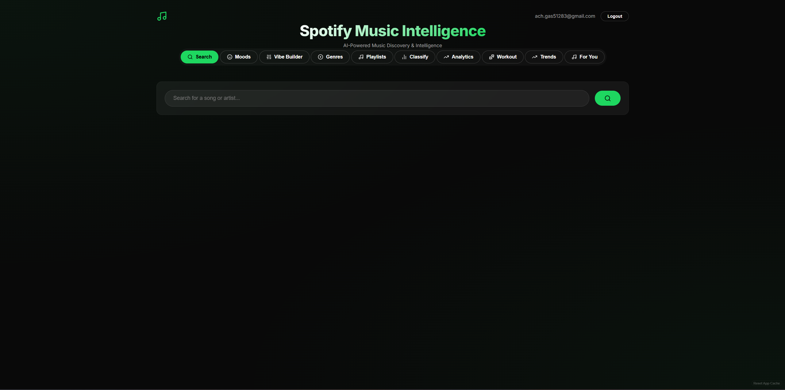
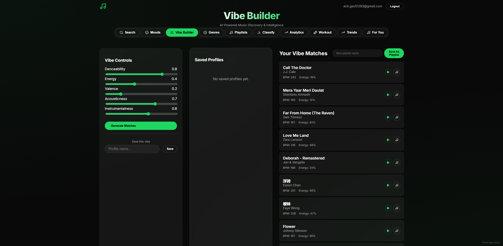
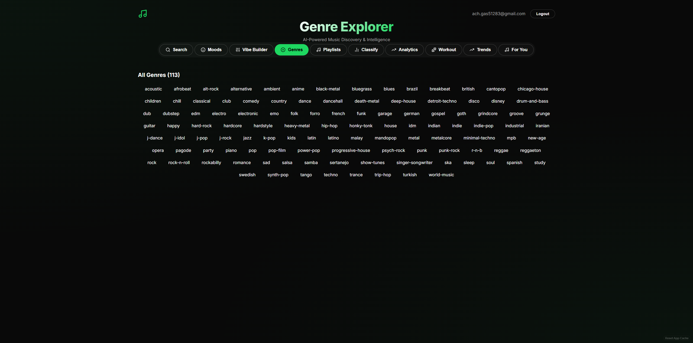
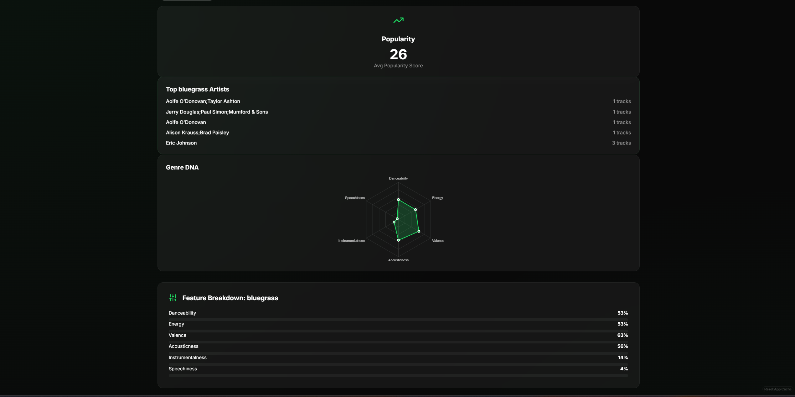
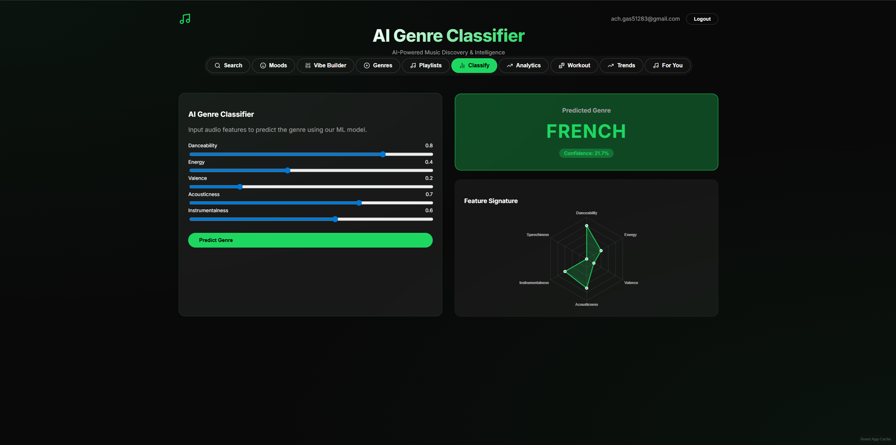
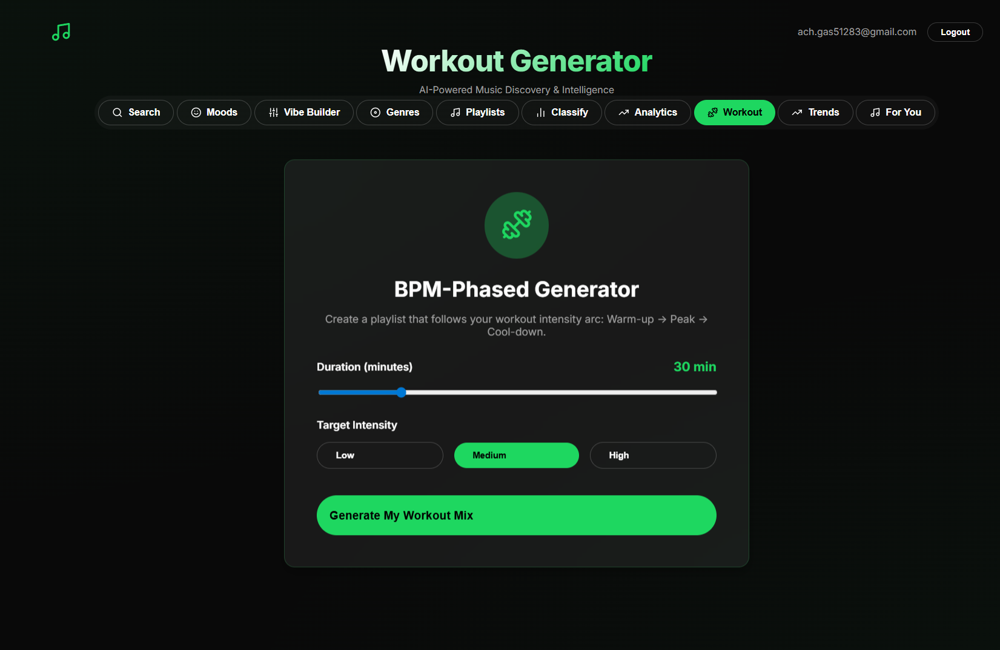
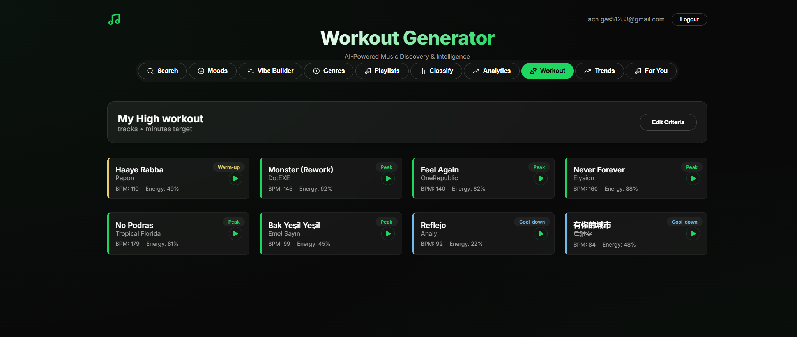
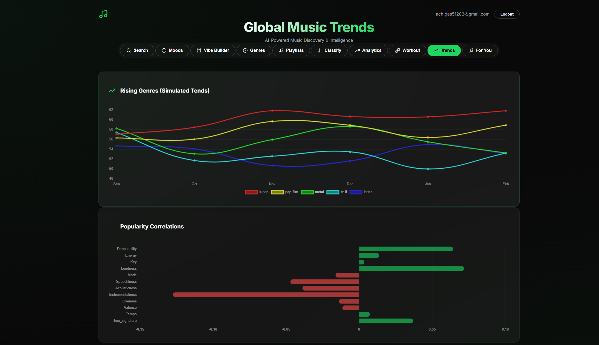

# 🎵 Spotify Music Intelligence Platform

A sophisticated machine learning-powered application that goes beyond simple metadata to recommend music based on **audio features** (energy, valence, danceability, etc.).

---

## 🎬 Demo

[](https://youtu.be/Q4dieFE8nOA)

---

## 📸 Screenshots

### 🏠 Home — Search


### 😃 Mood-Based Discovery


### 🎛️ Vibe Builder


### 🎵 Genre Explorer


### 📊 Genre DNA Analytics


### 🧠 AI Genre Classifier


### 📈 Listening Analytics


### 🏃 Workout Generator — Setup


### 🏃 Workout Generator — Results


### 📉 Global Music Trends


### 🤖 Personalized For You


---

## 🚀 Features

### 1. **Enhanced Mood-Based Discovery** 😃😢⚡🥳💪☕
Don't know what to listen to? Choose a mood, and the AI will find tracks that match that emotional curve.
- **Happy**: High valence, high energy.
- **Melancholic**: Low valence, slower tempo.
- **Energetic**: High tempo, high energy.
- **Focus**: Low acousticness, consistent rhythm.
- **Party**: High danceability and positive energy.
- **Workout**: Highest energy and high BPM (>120).
- **Chill**: Low energy, high acousticness/instrumentalness.

### 2. **Vibe Builder & Preference Profiles** 🎛️💾
Fine-tune your recommendations with precision and save your favorite settings:
- **Audio Control**: Set specific levels for **Danceability**, **Energy**, **Acousticness**, **Instrumentalness**, and **Valence**.
- **Save Profiles**: Save your current vibe as a named profile (e.g., "Deep Study" or "Midnight Drive").
- **Quick Load**: Instantly switch between your saved profiles to update your discovery settings.

### 3. **Smart Playlist Management** 🎵➕
- **Direct Add**: Add any recommended track to your existing playlists with a single click.
- **Auto-Generate**: Create entire playlists based on a single seed track or a specific mood.
- **Personal Library**: Manage your musical discoveries easily from the Playlists tab.

### 4. **Genre Classification AI** 🧠
- Implements an **XGBoost Classifier** trained on **89,000+ tracks** (125 genres).
- Predicts genres based solely on audio features with confidence scores.

### 5. **Personal Listening Analytics** 📊🎧
Discover your musical DNA with detailed insights into your listening habits:
- **Audio DNA**: Visualizes your average audio features (energy, danceability, etc.) across all track plays.
- **Genre Distribution**: See your top genres at a glance.
- **Interactive History**: Tracks every session and provides real-time updates to your dashboard.

### 6. **BPM-Phased Workout Generator** 🏃‍♂️🔥
Generate playlists that match the physical intensity of your workouts:
- **Intensity Arc**: Sequenced from **Warm-up** (low-mid BPM) to **Peak** (high energy) and **Cool-down**.
- **Custom Duration**: Set your target time from 15 to 90 minutes.
- **Phase Visuals**: Tracks are color-coded by workout phase for easy navigation.

### 7. **Genre Analytics Dashboard** 📈🔍
Deep dive into the characteristics of 125 different musical genres:
- **Genre DNA**: Every genre has a dedicated analytics dashboard visualizing its unique audio profile.
- **Market Insights**: Integrated data on average track popularity and top artists within each genre.
- **Top Artist Discovery**: Identify the most representative artists for any given genre.

### 8. **Hybrid "For You" Intelligence** 🤖✨
- **Collaborative Filtering**: Recommends tracks based on what users with similar tastes enjoy.
- **Content-Based (Pinecone)**: Uses a 12-feature vector space to find songs that match your history.
- **Diagnostic Reset**: Built-in "Reset App Cache" tool to force-synchronize microservice updates.

---

## 🛠️ Technology Stack

### Backend (Microservices)
- **Framework**: FastAPI (Python 3.13)
- **Vector Database**: Pinecone (v6) for sub-second similarity search
- **Database**: PostgreSQL (Containerized) with SQLAlchemy ORM
- **Machine Learning**: `scikit-learn`, `xgboost`, `pandas`
- **Security**: JWT Authentication with synchronized `SECRET_KEY`

### Frontend
- **Framework**: React 19 (Vite)
- **Design**: Real-time Audio Visualizer and Glassmorphism UI
- **State**: React Hooks
- **Communication**: Axios

---

## 💻 Installation & Setup (Docker Recommended)

The entire platform is optimized for **Docker Compose**.

### 1. Build the Base Image
```bash
docker build -t spotify-base -f backend/Dockerfile.base backend
```

### 2. Launch the Stack
```bash
docker-compose up --build -d
```

### 3. Verification & Sync
Once the containers are up:
1. Access the UI at `http://localhost`
2. If you see cached data or black screens, click **"Reset App Cache"** in the bottom-right corner
3. Seed the tracks if empty:
```bash
docker exec -it recommendation-playlist-service-1 python shared/seed.py
```

---

## 👤 Author

**Achraf Gasmi**
- GitHub: [@achraf-gasmi](https://github.com/achraf-gasmi)
- LinkedIn: [Achraf Gasmi](https://www.linkedin.com/in/achraf-gasmi-592766134/)

---

## 📄 License

This project is licensed under the MIT License.
